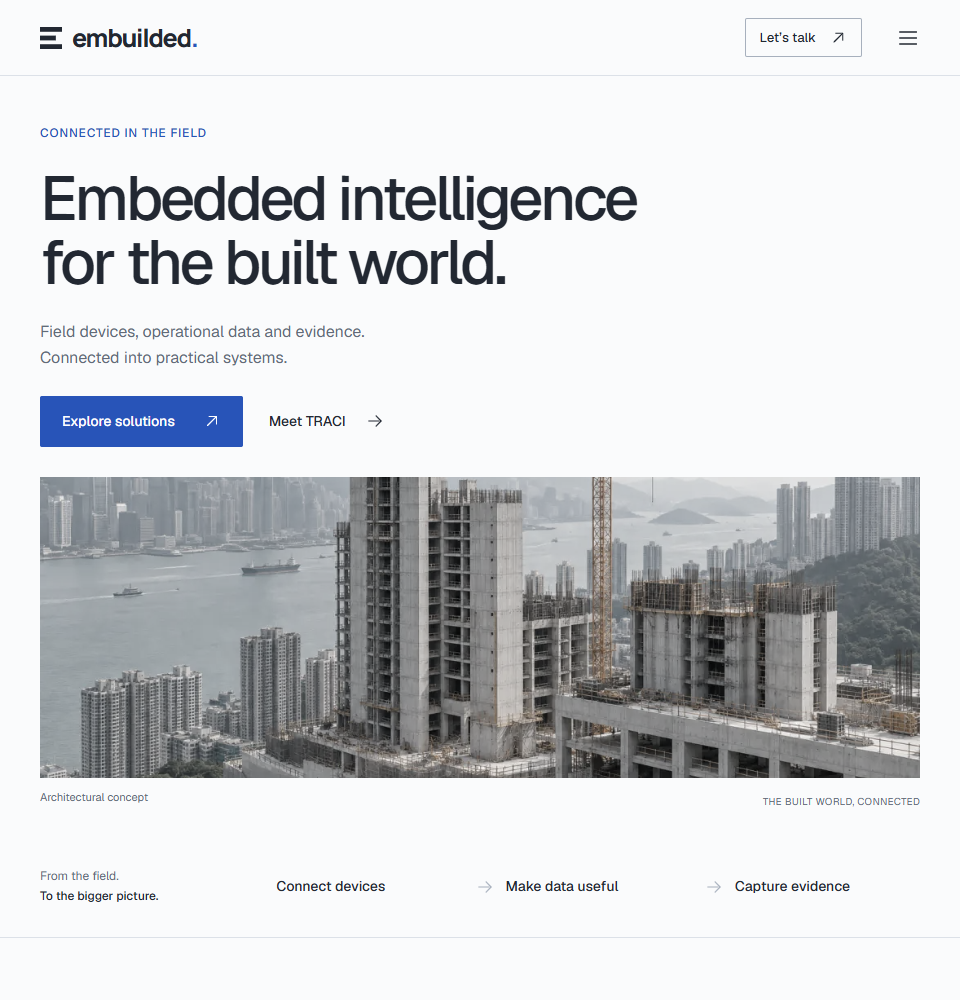
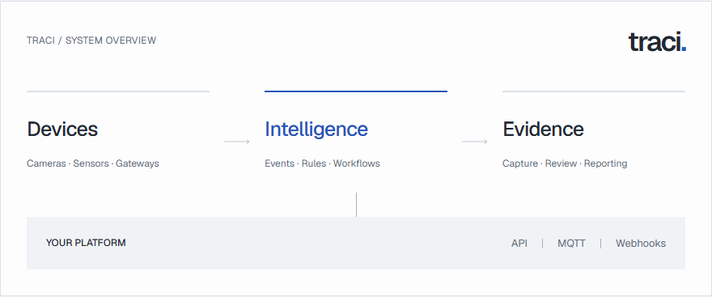

# Visual Redesign

Historical record: the palette, typography and hero decisions below were superseded on 18 September 2026 by [BUILDING_DESIGN.md](BUILDING_DESIGN.md). The preserved-content baseline continues to apply.

## Brief and preservation boundary

The user requested a complete visual overhaul while retaining every existing text, page, content section and interaction. The reference is the preserved upstream taste-skill, especially its brief inference, redesign protocol, typography, icon, layout and anti-template guidance.

Reading this as a corporate website for built-environment operators and engineering partners, with a precise industrial visual language and an architectural composition.

Baseline: commit `3e99e01f506b53fedef7c7cae031058052f9fdaa`. Preserve the nine main routes, six solution routes, section order, headings, copy, form fields, navigation labels, anchors, metadata and inquiry behavior. The original requirements directory remains read-only. The existing wordmark is retained.

## Audit

The previous presentation uses Manrope, pale green surfaces, an orange accent, repeated bordered cards, decorative line icons and prominent category numbers. The homepage's narrow hero and oversized image caption compete with the message. The TRACI diagram uses generic large glyphs with a shaded central box, rather than a clear relationship between stages. Text weight and scale vary too much across tablet and desktop.

The current implementation already uses SVG library icons, not emoji characters. The redesign addresses the visual treatment: remove decorative glyphs, reserve small consistent SVGs for recognizable controls and device categories, and make the architecture understandable through its layout and connections.

## Design direction

- Graphite text, cool white and silver surfaces, one blue accent.
- Self-hosted Geist for body and display typography; retain the existing wordmark treatment.
- A wide architectural homepage hero with natural heading proportions and a caption outside the image.
- Open layouts with deliberate alignment, varied section composition and fewer containers.
- A typographic TRACI diagram with connected stages and a clear interface to the partner platform; no invented dashboard or live status.
- Compact device category glyphs drawn from the existing Phosphor SVG family, with consistent regular weight.
- Shared square geometry with a small radius for controls. No ornamental frames, fake equalizer, decorative document icons or colored status dots.
- Short feedback transitions and an accessible mobile disclosure menu. No scroll hijacking.
- System light and dark color tokens, with a consistent theme across every section and no extra theme-switching control.

`DESIGN_VARIANCE: 7`, `MOTION_INTENSITY: 3`, `VISUAL_DENSITY: 3`. Composition varies to suit each section while the engineering content stays easy to scan. Motion serves interaction feedback. Spacing is generous without forcing the main action below the fold.

## Applying the skill to this request

The user's content-preservation instruction overrides upstream suggestions to rewrite copy, remove labels or change repeated CTA wording. Existing category numbers and captions are retained but visually subordinated. No extra imagery, facts, testimonials or new product capabilities are introduced. The existing generated architectural image remains clearly identified as a concept. This is a custom corporate visual system, not an implementation of Carbon or another product design system.

## Verification plan

Capture the existing rendered text, heading order, links, field order, anchors and metadata for all 15 routes before editing. Compare the redesigned rendering to this baseline. Review screenshots at 375, 768, 960 and 1440 pixels, with particular attention to the user's tablet-sized examples. Check the full page family, navigation, catalog and inquiry states, contrast, keyboard focus and reduced motion. Run the production build, existing functional checks and Lighthouse before publishing.

## Status

### Homepage preview

### TRACI architecture

Visual implementation and screenshot review are complete. The preserved content fixture is versioned at `website/tests/fixtures/redesign-content.json`. `npm run test:content` verifies all 15 routes against the baseline; only use `node scripts/content-snapshot.mjs --capture` when intentionally establishing a new approved content baseline.

The content comparison passed, including header and footer text. Forty layout checks across 375, 768, 960 and 1440 pixels found no horizontal overflow. Twenty automated accessibility audits across representative page families in light and dark modes reported no WCAG A/AA violations. Screenshots are saved locally under `.artifacts/redesign/`.

The production build, lint checks and seven unit tests passed. Production browser verification identified a delayed first-viewport image on About; both concept-image placements now load eagerly, and the browser check waits for actual image decoding.

Implementation commit [`7e6a9d8`](https://github.com/Johnson-HK-RFID/website-development/commit/7e6a9d82722c96b312a4573702b6ef45cf777f59) is pushed to `main`. The [GitHub Actions run](https://github.com/Johnson-HK-RFID/website-development/actions/runs/35176110208) passed all checks, including the corrected production image check and the 15-route content preservation test. The final local production build, complete browser checks and content comparison also passed. The production preview is available at `http://localhost:3000` while the local server runs.

The final mobile Lighthouse audit scored 90 performance, 100 accessibility and 100 best practices, with CLS 0. SEO remains 66 because the review build intentionally blocks indexing. LCP was 3.0 seconds and TBT was 250 milliseconds; Lighthouse reported a slow-host CPU warning. These are local simulated results, and the LCP target still needs validation on staging. See [VERIFICATION.md](VERIFICATION.md) for details.
